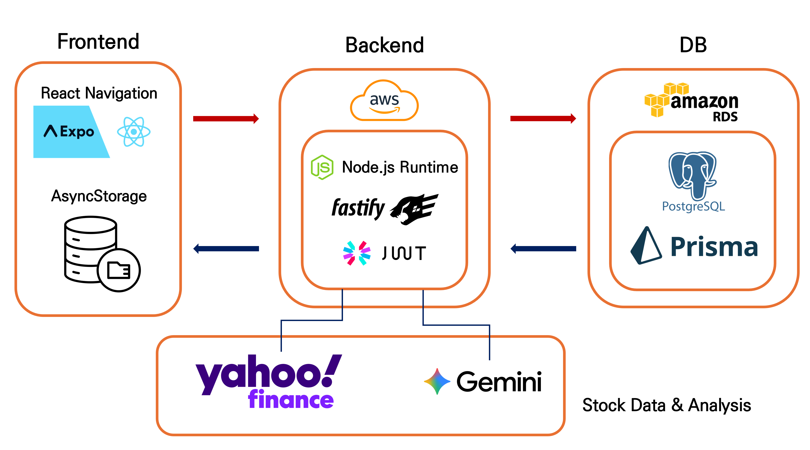
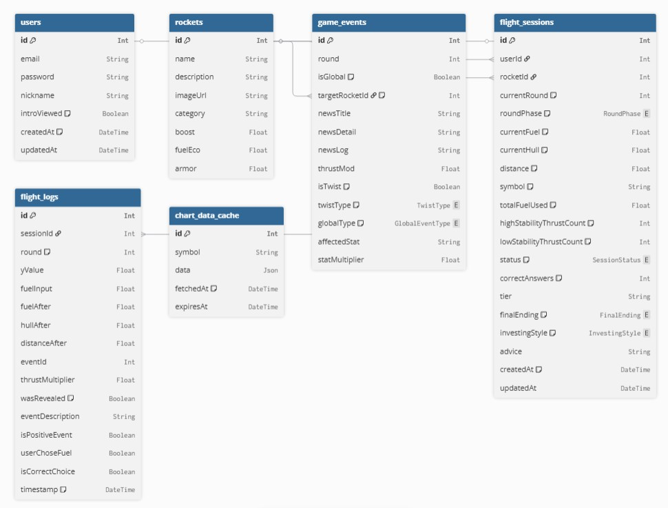

# 🚀 Doge in Mars (화성 갈끄니까)

> **"주식 시장의 변동성을 로켓의 엔진 출력으로 치환한다면?"**
> 실시간 금융 데이터 기반 항로 최적화 우주 항해 시뮬레이션입니다. 복잡한 재무 지표를 직관적인 로켓 성능으로 시각화하여, 주식을 모르는 입문자도 게임을 통해 자연스럽게 시장의 원리를 체득할 수 있습니다.

---

## 🛰️ 1. 핵심 메커니즘: Investment to Physics

이 게임은 복잡한 재무 제표 대신 '로켓 성능'을 확인하며 시작됩니다. 각 지표는 실제 주식 시장의 특성을 물리 법칙으로 반영합니다.

| 재무 지표 | 로켓 성능 지표 | 게임 내 효과 |
| --- | --- | --- |
| **PER** (주가수익비율) | **Boost** (가속 폭발력) | 저평가 종목이 상승장에서 강력하게 치고 나가는 힘 |
| **PBR** (주가순자산비율) | **Armor** (선체 내구도) | 자산이 튼튼한 기업이 하락장의 충격(Gravity Trap)을 견디는 방어력 |
| **ROE** (자기자본이익률) | **Fuel Eco** (연비 효율) | 자본을 효율적으로 사용하여 장거리 비행을 지속하는 능력 |

---

## 🛠️ 2. 기술 스택 (Tech Stack)

### 🎨 Frontend

* **Language/Framework**: TypeScript, React Native (Expo)
* **UI/Graphics**: React Native SVG (차트 시각화), Reanimated (애니메이션), Skia
* **Media**: Expo AV / Video (효과음 및 결과 영상 재생)

### ☁️ Backend & Infra

* **Framework**: Fastify (Node.js Runtime)
* **Database**: PostgreSQL (AWS RDS)
* **ORM**: Prisma
* **Auth**: JWT & Bcrypt (보안 인증)

### 📍 External API

* **AI/LLM**: Google Gemini API (분석 및 콘텐츠 생성)
* **Financial Data**: Yahoo Finance API (실시간 주가 데이터)

---

## 📐 3. 시스템 아키텍처 및 DB 스키마

### 시스템 아키텍처

### Database Schema


```dbml
// Doge in Mars DB Schema (DBML)
// Generated from Prisma Schema

Project DogeCityInMars {
  database_type: 'PostgreSQL'
  Note: '화성 갈끄니까 - 데이터 기반 항로 최적화 게임'
}

//--- Enums ---

Enum TwistType {
  NONE
  POSITIVE
  NEGATIVE
}

Enum GlobalEventType {
  BEAR_TRAP
  BULL_RUN
  BUBBLE_BURST
  NEUTRAL
}

Enum RoundPhase {
  NEWS
  PLAYING
  RESULT
}

Enum SessionStatus {
  IN_PROGRESS
  COMPLETED
  FAILED
}

Enum InvestingStyle {
  AGGRESSIVE_GROWTH
  BALANCED_INVESTOR
  CAUTIOUS_VALUE
  RISK_TAKER
  DEFENSIVE
}

Enum FinalEnding {
  CRASH
  MARS
  INVASION
}

//--- Tables ---

Table users {
  id Int [pk, increment]
  email String [unique]
  password String
  nickname String
  introViewed Boolean [default: false]
  createdAt DateTime [default: `now()`]
  updatedAt DateTime
}

Table rockets {
  id Int [pk, increment]
  name String [unique]
  description String
  imageUrl String
  category String
  boost Float // PER 매핑
  fuelEco Float // ROE 매핑
  armor Float // PBR 매핑
}

Table game_events {
  id Int [pk, increment]
  round Int
  isGlobal Boolean [default: true]
  targetRocketId Int [note: 'Specific 이벤트일 경우']
  
  newsTitle String
  newsDetail String
  newsLog String
  
  thrustMod Float
  isTwist Boolean [default: false]
  twistType TwistType [default: 'NONE']
  globalType GlobalEventType
  
  affectedStat String
  statMultiplier Float
}

Table flight_sessions {
  id Int [pk, increment]
  userId Int
  rocketId Int
  
  currentRound Int [default: 1]
  roundPhase RoundPhase [default: 'NEWS']
  currentFuel Float [default: 100.0]
  currentHull Float [default: 100.0]
  distance Float [default: 0.0]
  
  symbol String [default: 'AAPL']
  
  totalFuelUsed Float [default: 0.0]
  highStabilityThrustCount Int [default: 0]
  lowStabilityThrustCount Int [default: 0]
  
  status SessionStatus [default: 'IN_PROGRESS']
  correctAnswers Int [default: 0]
  
  tier String
  finalEnding FinalEnding
  investingStyle InvestingStyle
  advice String
  
  createdAt DateTime [default: `now()` ]
  updatedAt DateTime
}

Table flight_logs {
  id Int [pk, increment]
  sessionId Int
  round Int [default: 1]
  
  yValue Float
  fuelInput Float
  
  fuelAfter Float
  hullAfter Float
  distanceAfter Float
  
  eventId Int
  thrustMultiplier Float
  wasRevealed Boolean [default: false]
  eventDescription String
  
  isPositiveEvent Boolean
  userChoseFuel Boolean
  isCorrectChoice Boolean
  
  timestamp DateTime [default: `now()` ]
}

Table chart_data_cache {
  id Int [pk, increment]
  symbol String [unique]
  data Json
  fetchedAt DateTime [default: `now()` ]
  expiresAt DateTime
}

//--- Relationships ---

Ref: flight_sessions.userId > users.id [delete: cascade] // 유저별 항해 세션
Ref: flight_sessions.rocketId > rockets.id // 세션에서 사용된 로켓
Ref: game_events.targetRocketId > rockets.id // 특정 로켓 대상 이벤트
Ref: flight_logs.sessionId > flight_sessions.id [delete: cascade] // 세션별 행동 로그
```
---

## 🛸 4. 주요 기능 소개

### 🔐 보안 및 사용자 관리

* **JWT 기반 인증**: 안전한 세션 유지 및 7일간의 로그인 상태 지속
* **사용자 편의**: `introViewed` 필드를 통해 재방문 시 인트로 영상 스킵 기능 제공

### 🚀 데이터 통합 분석 및 항로 제어

1. **News Phase**: 심우주 센서(뉴스)와 AI 네비게이터의 분석 제공
2. **Playing Phase**: 실시간 중력파(Yahoo Finance 차트) 분석
3. **Fuel Control**: 뉴스 해석과 차트 추세를 종합하여 슬라이더로 연료 출력 결정

### 📊 항해 선택 결과 매트릭스

| 상황 (Event) | 유저 선택 | 결과 | 영향 |
| --- | --- | --- | --- |
| **호재** (Positive) | 출력 높임 | **정답** | 추진력 극대화, 이동 거리 비약적 상승 |
| **악재** (Negative) | 출력 낮춤 | **정답** | 엔진 과부하 방지 및 선체 내구도 보존 |

---

## 🏆 5. 최종 판정 및 엔딩 (Tiers)

6번의 라운드 동안의 선택 결과에 따라 총 3가지의 멀티 엔딩을 제공합니다.

* **💥 CRASH** (0~2개 정답): 화성 도착 실패 및 선체 파손
* **🏙️ MARS** (3~5개 정답): 안정적인 화성 안착 및 도시 건설
* **🐕→👤 INVASION** (6개 정답): 도지가 진화하여 지구를 역침공하는 진 엔딩

> **투자 성향 진단**: 게임 종료 후 유저의 판단 데이터를 분석하여 5가지 투자 페르소나(공격적 성장형, 신중한 가치형 등) 중 하나를 진단합니다.

---

## 🧑‍💻 Our Team

* **민동휘 (Donghwi Min)**: Frontend Developer | alsehdgnl@kaist.ac.kr
* **박찬우 (Chanwoo Park)**: Backend Developer | yetpi0413@korea.ac.kr